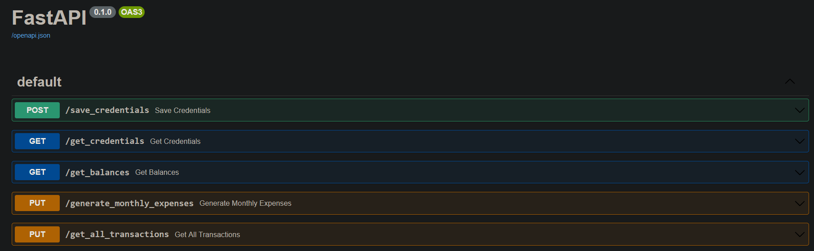

# Expense tracker

The Expense Tracker project allows a person to track their expenses for an account with Investec using an API.

## General instructions

## Project structure and quick overview
```angular2html
C:.
│   credentials.json (a generated file which contains credentials)
│   data_manipulation.py (package for processing data into reports)
│   investec_requests.py (package for using Investec API)
│   main.py (main code needed to run API)
│   Readme.md
│   requirements.txt (the used dependencies)
│   test_api.py (a few test functions to test locally)
│
└───reports (reports generated from the service)
        all_transactions_from_2014-01-20_to_2022-12-20_7577875582110190543489163.csv
        all_transactions_from_2014-01-20_to_2022-12-20_7577875582110190543603395.csv
        monthly_summary_7577875582110190543489163.csv
        monthly_summary_7577875582110190543603395.csv
```

## How to run the project for the first time

### Running via PyCharm
- Open the project in PyCharm
- Open the requirements folder and make sure all the dependencies are installed
- run the main.py file


### Running via command line
Locate the project via the command line to run the following instructions (you need python installed to to have it work).

#### Install the needed dependencies
```bash
pip install -r requirements.txt
```

#### Run the project with the following command line
```bash
uvicorn main:app --reload --port 8080
```


### Working with the service via swagger
To check if the project is working you can interact with the service at the following link
http://127.0.0.1:8080/docs#/

It will lead to a page which resembles the following image, which you can use to execute the various services within the project.


You need a credentials.json file to get started, so please see the documentation under save_credentials to see how to generate the file 
If you want to make sure the service is working, you can run the test_api.py package as main and it will run a basic version of all the functionality once the credentials have been appropriately set up


## Endpoints available and what they do

You can access the service by making use of test_api.py, postman or swagger
The easiest way to demo basic functionality is by making use of swagger by following the link http://127.0.0.1:8080/docs#/
 and just pressing 'try it out' followed by 'Execute'. The following tutorial also demonstrates the basic use case https://www.youtube.com/watch?v=KUxCGqu-Xhg

### save_credentials
This API saves a user's credentials used by the service into a file called credentials.json file, which will be used in perpetuity by the project.
Once this is set up you will be able to use it indefinitely without needing to change it, and if you use to switch between users, you can simply enter in a new set of credentials and that will be saved and used from that point onwards 
```angular2html
{
  "client_id": "string",
  "client_password": "string",
  "x_api_key": "string"
}
```

You can also create this file manually, it follows the same format
### get_credentials
This service shows the user which set of credentials are currently saved by the system by returning the following
```angular2html
{
  "client_id": "xxxx",
  "x_api_key": "xxxx"
}
```
The client_password will not be returned for security reasons
### get_balances

This service returns your current balance and your available balance for each of your transactions in a json format
```json
"[
  {'account_id': 'xxx', 'currentBalance': 1234, 'availableBalance': 1234}, 
  {'account_id': 'xxx', 'currentBalance': 1234, 'availableBalance': 1234}
]"
```

### generate_monthly_expenses
This service generates a report for each of your accounts named "reports/monthly_summary_{account_number}.csv"
It is in a CSV format, which it then summarised by the transaction type for each month up to now
```csv
y,m,transactionType,amount
2022,10,CardPurchases,xxx
2022,10,Deposits,xxx
2022,10,FeesAndInterest,xxx
2022,11,CardPurchases,xxx
```
If you are in windows, using excel and the report is only in the first column with commas, you can use the following guide to separate it into individual columns https://support.goteamup.com/faq-when-opening-.csv-file-all-data-appears-in-one-column <br />

From here you can see the summaries of each year and month for each category and you can easily make some graphs to track how your information has changed over the last few months
### get_all_transactions
If you want to get an output of all your transactions between two dates this service will generate a report similar to 
generate_monthly_expenses, you can use the get_all_transactions and enter which dates you would like the service to predict between

```json
{
  "start_date": "yyyy-mm-dd",
  "end_date": "yyyy-mm-dd"
}
```
This will output a report named "all_transactions_from_{start_date}\_to_{end_date}_{account_id}.csv"

Here you can go through each of your transactions between the two specific dates
